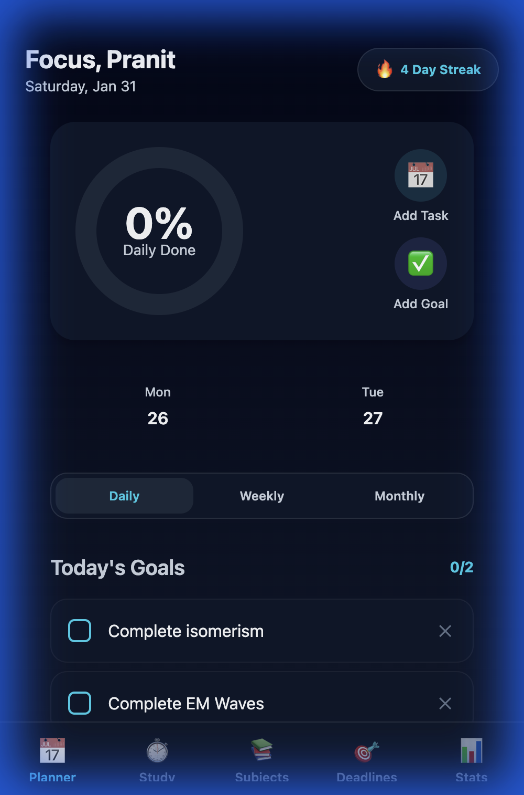
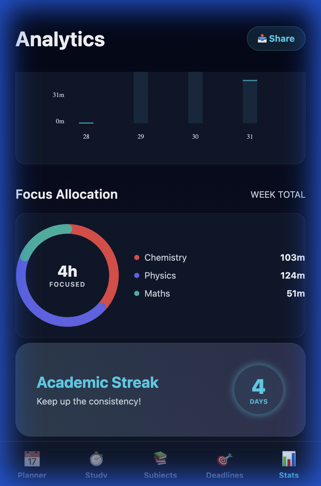
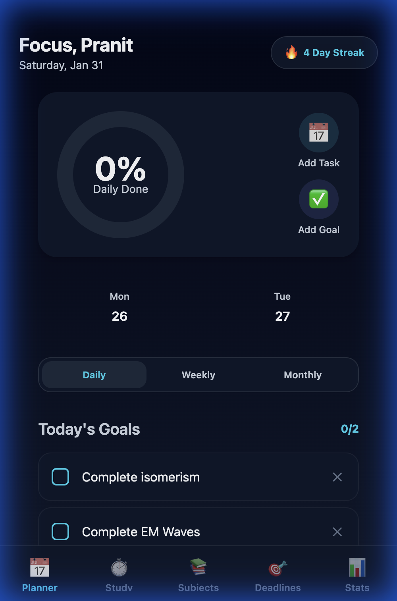

# 🚀 Study Planner Premium

A high-performance, cross-platform study companion designed to help students maximize focus and achieve academic excellence. Built with **React Native**, **Expo**, and **Supabase**.

<div align="center">
  
  
</div>

## ✨ Key Features

- **Personalized Onboarding**: Tailored experience with custom username and profile settings.
- **Cloud Sync**: Seamless data synchronization across all your devices via Supabase.
- **Modern Analytics**: 
  - **Donut Chart**: Beautiful SVG-based focus allocation breakdown.
  - **Performance Trends**: Weekly study time visualization.
  - **Momentum Recap**: Quick look at your daily, weekly, and monthly goal completions.
- **Smart Planner**: Effortlessly manage study sessions, topics, and priorities.
- **Achievement System**: Earn badges and maintain streaks to stay motivated.
- **Seamless Local Migration**: Easily transfer your existing local data to the cloud.

## 🎨 Design Philosophy

Study Planner Premium follows a **Deep Dark** aesthetic with vibrant **Cyan & Violet** accents. 
- **Glassmorphism**: Subtle glass-like UI elements for a premium feel.
- **Modern Typography**: Clear hierarchy using the Outfit font family.
- **Micro-interactions**: Haptic feedback and smooth transitions for a responsive experience.

## 🛠️ Tech Stack

- **Frontend**: React Native, Expo (SDK 50+)
- **Backend/Database**: Supabase (PostgreSQL, Auth, RLS)
- **State Management**: React Hooks & Context API
- **Charts**: Custom SVG Donut Charts & `react-native-chart-kit`
- **Storage**: Local persistence with fall-back cloud sync.

## 🚀 Getting Started

### Prerequisites
- Node.js (v18+)
- Expo Go app on your phone (for mobile testing)
- Supabase account

### Installation

1. **Clone the Repo**
   ```bash
   git clone https://github.com/Anonymous12-tech/study-planner-premium.git
   cd study-planner-premium
   ```

2. **Install Dependencies**
   ```bash
   npm install
   ```

3. **Supabase Setup**
   - Head to your Supabase project.
   - Run the code in `schema.sql` inside the **SQL Editor** to set up tables, RLS policies, and triggers.
   - Create a `.env` file or update `utils/supabase.ts` with your Supabase URL and Anon Key.

4. **Run the App**
   ```bash
   npx expo start
   ```
   Press `w` for Web or scan the QR code for iOS/Android.

## 📸 Screenshots

### Daily Planner & Goals


### Advanced Analytics


---
Developed with ❤️ by the Study Planner Team.
